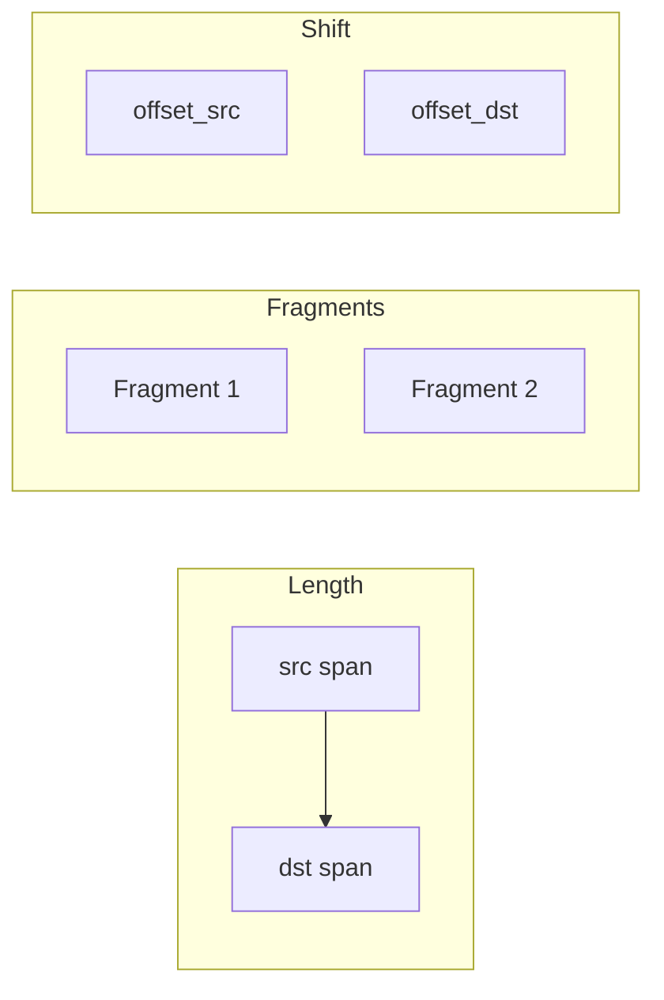
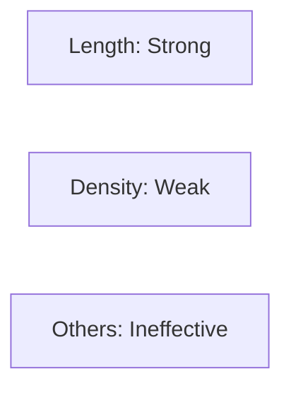
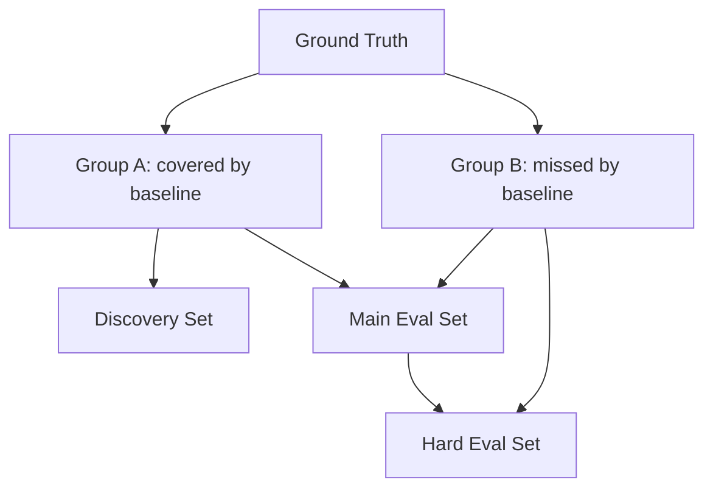

# Streamlit 汇报网页展示计划

## 1. 丰满演示：建议加入的内容

在现有 6 页基础上，建议增加或强化的内容如下（便于汇报时更连贯、有说服力）：

- **导航与结构**
  - 侧边栏或顶部 Tab：Hero → Overview → Naive Signals (定义 → 结果) → Dataset Restructuring → LLM Discovery → Next Steps，便于汇报时快速跳转。
  - 每页末尾可加「下一页」引导（如从 Overview 到 Naive Signals），形成线性叙事。
- **Page 1（项目概览）**
  - 在「Data used」下加一句：**Hume 子集 = 17 ECCO IDs，仅 Hume → others 方向**，与 1.2 呼应。
  - 右栏统计卡片可再增加：**Raw reuse 与 GT 的坐标对齐已核对**（一句话即可），增强可信度。
- **Page 2（Naive 信号定义）**
  - 每个信号族（Length / Fragmentation / Span expansion / Coverage / Density / Alignment）用 **可折叠卡片** 展示名称 + 简短定义；文档中的公式（如 `dst_trs_end − dst_trs_start`）保留在卡片内。
  - 在「Suggested visual」处预留 **每类一个 schematic 示意图** 的占位（见下文 Mermaid/占位）。
- **Page 3（Naive 结果）**
  - **3.1 特征对比表**：保留完整表格；可在表上方加一句说明：「Positive = reprint, Negative = non-reprint」。
  - **3.2 阈值扫描**：按特征分组用 **Tabs**（或 Accordion）展示，每 Tab 内一张小表 + 方向说明（≥/≤）。
  - **3.3 分析摘要**：用 **高亮侧栏或 callout 框** 展示「Tested signal families」「Key finding: length」「Weak: density」「Ineffective signals」。
  - **3.4 Takeaway**：保留引用块 + **柱状图/横向排名图** 占位（Length=strong, Density=weak, others=ineffective）。
- **Page 4（数据集重构）**
  - 三栏卡片：Discovery / Main Eval / Hard Eval，每栏列出条数 + 类型计数（Attributed/Unattributed/Quoted/Cribbed）+ 按 `src_doc_id` 的计数（可折叠或「展开查看」）。
  - 增加 **Group B 与 Hard negatives** 的简短说明（24 pairs / 75 pairs, 140 entries），便于解释「难例」定义。
  - 预留 **GT → Group A/B → Discovery / Main / Hard** 的划分图占位。
- **Page 5（LLM 发现）**
  - 保持「少字多图」：1 个工作流图 + 1 个示例 pair 对比（高亮 reuse span）+ 1 个小框列出初步信号组。
  - 示例对比：若要做成交互式「ecco-ecco 风格」详情，需要的数据点见下节。
- **Page 6（下一阶段）**
  - 用简短列表 + 最终陈述即可；可选加一个 **Timeline/roadmap** 小图（Mermaid 或占位）：Normalize → Validate → Hard-case → Framework。
- **通用**
  - 所有「Suggested visual」在文档中的位置都在 Streamlit 里用 **占位区域**（标题 + 可选 Mermaid 代码块 + 说明「可替换为导出图」）实现，您后续用代码制图后替换为 `st.image` 或静态图。

---

## 2. 需要制图的部分：所需数据 + Mermaid 代码 + 图片占位

以下每处都会在 Streamlit 中预留 **固定标题 + 占位区域**，您用代码出图后替换为图片即可。

### 2.1 Page 1：整体工作流（Raw reuse pairs → GT → signal analysis → detection framework）

- **需要的数据**：无额外数据，仅为流程节点名称。
- **Mermaid 代码**（可直接放进占位，或您用其逻辑制图后替换为图）：

- **占位说明**：`[Placeholder: workflow figure - raw reuse pairs → GT comparison → signal analysis → detection framework]`

---

### 2.2 Page 2：每类信号的 schematic（可选 4 合 1 或分开展示）

- **需要的数据**：仅概念（span length / overlap / fragments / shift），无数值。
- **Mermaid 示例**（span + overlap + fragments 概念）：

- **占位说明**：`[Placeholder: schematic - span length / overlap / fragments / shift]`（若您用 Python 制图，可一图含 4 个小图更清晰）。

---

### 2.3 Page 3：信号强弱排名（Length = strong; Density = weak; others = ineffective）

- **需要的数据**（用于您自己画柱状图/横向条形图）：
  - 分类标签：`Length`, `Density`, `Fragmentation`, `Span ratio`, `Coverage`, `Alignment`
  - 强度/类型：`strong` / `weak` / `ineffective`（或 1/0.5/0 的数值用于条形长度）
- **Mermaid 示意**（仅作结构示意，实际建议用 Python 出图）：

- **占位说明**：`[Placeholder: bar chart or horizontal ranking - Length strong, Density weak, others ineffective]`

---

### 2.4 Page 4：数据集划分（GT → Group A/B → Discovery / Main Eval / Hard Eval）

- **需要的数据**：节点与边即可（数量文档中已有）。
- **Mermaid 代码**：

- **占位说明**：`[Placeholder: split diagram - GT → Group A/B → Discovery / Main Eval / Hard Eval]`

---

### 2.5 Page 5：LLM 发现工作流

- **需要的数据**：步骤名称。
- **Mermaid 代码**：

- **占位说明**：`[Placeholder: workflow - Discovery set → context extraction → Qwen3-30B → signal output → inventory]`

---

### 2.6 Page 5：示例 pair 对比（高亮 reuse span）

- **需要的数据**：见下节「细节展示数据点」；此处仅预留位置，用「示例 pair 的 src/dst 文本片段 + 高亮区间」展示，或您导出为图后插入。
- **占位说明**：`[Placeholder: example pair comparison with highlighted reuse span]`

---

### 2.7 Page 6：下一阶段 Timeline（可选）

- **Mermaid 代码**：

- **占位说明**：`[Placeholder: next-stage timeline]`

---

## 3. 参考 ecco-ecco 的细节展示：需要的数据点（先不写实现）

若在汇报页中要做「ecco-ecco 风格」的**单对详情展示**（例如 Page 5 的示例 pair，或单独一个「Example pair」页），需要以下数据点与结构（与 [app_blocks.py](code/app_blocks.py) 中 `render_block_comparison` 对齐）：

- **Pair 级**
  - `src_doc_id`, `src_section_id`（源篇目）
  - `block_a` / `block_b` 至少一个存在；若做「选 Block A/B」需两个都有
  - `essay_ratio`, `intersection_len`, `min_block_length`
  - `dst_doc_id_a`, `dst_doc_id_b`（用于标签展示）
- **Block 级（每个 block_a / block_b）**
  - 源侧：`src_doc_id`, `src_section_id`, `src_trs_start`, `src_trs_end`, `src_trs_url`, `src_piece_length`；可选 `src_section_url`
  - 目标侧：`dst_doc_id`, `dst_trs_start`, `dst_trs_end`, `dst_trs_url`, `dst_piece_length`, `fragment_count`
  - 文本（二选一即可）：block 内 `src_text` / `dst_text`，或通过 `(doc_id, trs_start, trs_end)` 从 text cache 取
- **元数据（用于展示「Publication Date」等）**
  - 源/目标 ECCO 的 metadata（如 `hume_outgoing_ecco-ecco_original_only_merged_with_urls.json` 或现有 metadata JSON）：`doc_id` → publication date / year
  - 若需 Section header：需 `src_section_id` 对应标题（如现有 `_get_src_section_header` 所用数据源）
- **展示形态（与 app_blocks 一致）**
  - 左栏：Target Essay (Source)：Doc ID, Section ID, Section Header, Publication Date/Year, Source Text（或 URL）
  - 右栏：Destination：Doc ID, Publication Date, TRS Range, Piece Length, Fragment Count, Destination Text（或 URL）
  - 底部：Pair Details（essay_ratio, intersection_len, min_block_length, dst_doc_id_a/b）
  - 若需「高亮 reuse span」：需要该 pair 的 `src_trs_start/end` 与 `dst_trs_start/end` 以及对应文本片段，用于前端高亮或导出示意图

**数据来源建议**：  

- 汇报用「示例 pair」可从现有 `all_reprint_pairs_enriched.json` 中选 1～2 条固定记录；  
- 若希望汇报时现场选 pair，则需要与现有 blocks 应用一样加载该 JSON + metadata，并只读展示（不需要筛选/分页的完整逻辑时可做简化版）。

以上仅列出**数据点与展示项**，不涉及具体 Streamlit 实现代码。

---

## 4. 按页面拆分模块 + 主入口只做导航（文件结构）

- **主入口**（保持短小，约几十行）：只负责导航与路由，不承载各页具体内容。
  - 例如 `app_presentation.py` 或现有 app 中的 Presentation 入口：侧边栏/`st.radio`/`st.selectbox` 选择页面 → `if page == "Overview": render_overview()` 等调用。
- **每页独立模块**，单文件约 150–400 行，便于维护和修改单页：
  - `presentation/hero.py` → Hero
  - `presentation/overview.py` → Project Overview
  - `presentation/naive_signals.py` → Naive Signal 定义（或再拆成 definitions + results 两个子模块）
  - `presentation/naive_results.py` → Naive Signal 结果（可选与上合并或拆分）
  - `presentation/restructuring.py` → Dataset Restructuring
  - `presentation/llm_discovery.py` → LLM-based Signal Discovery
  - `presentation/next_steps.py` → Next-stage Proposal
- **共享**：数据与常量可集中到 `presentation/data.py`（或 JSON），如表格数字、GT 统计、阈值表等，避免在 UI 模块里硬编码。

---

## 5. 每个步骤对应流程图

- **约定**：每个主要步骤（每页）都配有**至少一处流程图**，便于汇报时按步骤讲解。
- **已规划的流程图占位**（见第 2 节）与页面对应关系：
  - **Page 1 Overview**：整体工作流（Raw reuse → GT → signal analysis → detection framework）
  - **Page 2 Naive Signals**：每类信号 schematic（length / overlap / fragments / shift）
  - **Page 3 Naive Results**：信号强弱排名图（Length strong, Density weak, others ineffective）
  - **Page 4 Restructuring**：数据集划分（GT → Group A/B → Discovery / Main / Hard Eval）
  - **Page 5 LLM Discovery**：LLM 发现工作流（Discovery set → context → Qwen → signal output → inventory）
  - **Page 6 Next Steps**：下一阶段 Timeline（Normalize → Validate → Hard-case → Framework）
- 实现时每页模块内包含该页的 Mermaid 代码或 `st.image` 占位，保证「每步一图」。

---

## 6. 实验结果示例（正例、反例、找到的、没找到的）

在汇报中建议每类给 **1～2 个具体 pair 示例**（可点开看详情或固定展示），便于听众理解「长什么样」。建议四类如下：

| 类型                   | 含义                                               | 建议展示内容                                                                                               | 建议出现位置                                                         |
| -------------------- | ------------------------------------------------ | ---------------------------------------------------------------------------------------------------- | -------------------------------------------------------------- |
| **正例 (Positive)**    | GT 中的 reprint（Attributed / Unattributed Reprint） | 一对典型的 reprint pair：源篇目 + 目标篇目，reuse span 较长、对齐清晰；可展示 `reuse_length_dst/src`、essay_ratio 等            | Overview 或 Naive Results 页「What we want to detect」             |
| **反例 (Negative)**    | GT 中的 non-reprint（如 Quoted、Cribbed）              | 一对典型的引用/摘抄 pair：片段较短或零散，与正例形成对比；可标出 reuse type                                                       | Naive Results 页「What we need to separate from reprints」        |
| **找到的 (Found)**      | 被 length 基线覆盖的 reprint（Group A）                  | 一个被 `reuse_length_dst ≥ 阈值` 正确判为 reprint 的 pair；说明「单靠长度就能筛出」                                         | Restructuring 或 Naive Results 页「Baseline: what length catches」 |
| **没找到的 (Not found)** | 基线漏掉的 reprint（Group B）或基线误报（Hard negative）       | **Group B**：一个 reprint 但长度低于阈值被漏掉，说明需要更强信号；**Hard negative**：一个 non-reprint 被长度规则误判为 reprint，说明需要区分度 | Restructuring 页「Group B / Hard negatives」旁                     |

- **数据来源**：从现有 GT 与 `all_reprint_pairs_enriched.json`（及 split 标注）中按类型各选 1～2 条固定 `pair_id` 或 `(src_doc_id, src_section_id, dst_doc_id)`，在对应页用 ecco-ecco 风格详情块展示（左源右目标 + Pair Details）。
- **入口**：每页在流程图/表格附近设「Example: Positive / Negative / Found / Not found」小标题 + 展开或跳转到该 pair 的详情；若做统一「示例库」，可在侧栏或 Data 页用下拉选择类型后展示。

---

## 6.1 详细举例 display：位置与内容（10 项）

以下 10 项为**具体要加的详细举例展示**；每项只约定「放哪一页、哪一块、展示什么」，不涉及实现方式。

| #      | 名称                                  | 展示内容                                                                                                                                                      | 所在页面与位置                                                                                                                                                    |
| ------ | ----------------------------------- | --------------------------------------------------------------------------------------------------------------------------------------------------------- | ---------------------------------------------------------------------------------------------------------------------------------------------------------- |
| **1**  | **Length 正例**                       | 一条**长 reprint**，被 length baseline 正确命中（Group A 典型）。展示：该 pair 的源/目标片段 + reuse span 长度、essay_ratio 等，说明「长 reprint 单靠长度就能筛出」。                                | **Naive Signal Results** 页，在「Key finding: length」或特征对比表下方；标题如 "Example: Long reprint (baseline hit)".                                                      |
| **2**  | **Length 反例**                       | 一条**短 non-reprint** 或**短 reuse**（如短引用/摘抄）。展示：该 pair 的短片段，与正例对比，说明「短的不一定是 reprint，需要和长 reprint 区分」。                                                        | **Naive Signal Results** 页，在「What we need to separate」或反例说明旁；标题如 "Example: Short reuse / non-reprint".                                                     |
| **3**  | **Density 示意图**                     | **高 density** vs **低 density** 的直观对比：同一 source 被多个 destination 复用（高） vs 只被少数复用（低）。可用示意图或两列「高 density pair / 低 density pair」各一例 + `pair_reuse_density` 数值。 | **Naive Signal Analysis** 页，在 **pair_reuse_density** 信号卡片/定义旁；或 **Naive Results** 页 density 相关小结旁。标题如 "Density: high vs low (schematic or example pairs)". |
| **4**  | **Fragmentation 图**                 | **连续一大块 reuse** vs **多块碎片 reuse** 的对比。展示：一个 pair 的 reuse 是单段连续 vs 多个 fragment 的示意图或两例（num_fragments=1 vs >1），说明 fragmentation 信号的含义。                      | **Naive Signal Analysis** 页，在 **num_fragments / fragmentation** 信号卡片旁。标题如 "Fragmentation: continuous vs fragmented reuse".                                 |
| **5**  | **Found case**                      | **Baseline 成功命中的典型 reprint**（与 1 可同一条或再选一条）。强调：GT=reprint，length 规则判对。ecco-ecco 风格详情（左源右目标 + Pair Details）。                                               | **Dataset Restructuring** 页，在「Group A / Discovery 或 Main Eval」说明旁；或与 Naive Results 的 length 正例打通。标题如 "Found: typical reprint caught by baseline".          |
| **6**  | **Missed case**                     | **Baseline 漏掉但 GT 为 reprint**（Group B）。展示：一条 reprint 因 reuse 长度不足未被 length 规则命中。说明「需要更强/更多信号才能检出」。                                                        | **Dataset Restructuring** 页，在「Group B」说明旁。标题如 "Missed: reprint not caught by baseline (Group B)".                                                          |
| **7**  | **False positive**                  | **很长但不是 reprint**（Hard negative）。展示：一条 non-reprint（如长引用/摘抄）因 reuse 很长被 baseline 误判为 reprint。说明「长度会误报，需要区分度」。                                              | **Dataset Restructuring** 页，在「Hard negatives / baseline FPs」说明旁。标题如 "False positive: long reuse but not reprint".                                          |
| **8**  | **Same pair, context 200/500/1000** | **同一 pair** 在三种上下文窗口（200 / 500 / 1000 字符）下截取的**片段并排**。展示：同一 (src, dst) 在 context_200、context_500、context_1000 里给模型看的文本，便于理解「窗口长度如何影响输入」。                  | **LLM-based Signal Discovery** 页，在「Context construction」或「Model and context settings」旁；三栏或三块并排。标题如 "Same pair under 200 / 500 / 1000 char context".        |
| **9**  | **LLM 好 signal 例子**                 | **模型正确发现的有区分度的 signal**。展示：从 `signals_discovery_*.jsonl` 中选一条（或一条中的某个 signal）：名称、描述、supporting examples，说明该 signal 对 reprint vs non-reprint 有区分力。         | **LLM-based Signal Discovery** 页，在「More signals discovered」或「Preliminary signal groups」旁。标题如 "Example: useful signal discovered by LLM".                   |
| **10** | **LLM 被 artifact 带偏**               | **模型被 OCR/格式等 artifact 带偏**的例子。展示：一条 discovery 中过度依赖拼写/空格/换行等、或把 artifact 当稳定 signal 的内容；可配 caveats 或简短说明「需归一化/标为 risky」。                                 | **LLM-based Signal Discovery** 页，在「caveats / artifact-related」或 Takeaway 旁。标题如 "Example: LLM overfitting to OCR/formatting artifacts".                     |

- **数据来源**：**1、2、3、4、5、6、7** 的示例 pair 优先从 **`data/topk_by_feature.json`** 中按对应 signal/类型选取（该文件为在不同 signal 定义下选出的条目）；若无则从 GT + split（group_a / group_b / hard_eval 等）或 raw reuse 中选。**8** 来自 `data0309/context_200`、`context_500`、`context_1000` 中同一 pair 的条目。**9、10** 来自 `data0309/signals_discovery_200.jsonl`（或 500/1000）中选定的 round。
- **与 §6 的关系**：§6 的「正例/反例/找到的/没找到的」与上表 1、2、5、6、7 对应；此处把「放在哪、展示什么」细化到 10 项并增加 density/fragmentation 示意图、同一 pair 多窗口、LLM 好/坏例子。

---

## 7. 完整实验数据查看入口

- **目标**：让听众/合作者能**自行检索、查看原始与衍生数据**，而不是只看汇报摘要。
- **建议入口形式**：
  - 在导航中增加一项 **「Data & Search」**（或「Full Data」），与各汇报页并列。
  - 该页提供：
    - **Ground truth**：原始 GT 文件说明 + 可下载或只读预览（若 GT 为 CSV/JSON，可 `st.dataframe` 只读展示或提供下载链接）；若有多个 GT 文件（e.g. 按 split），用 Tabs 或下拉区分。
    - **检索**：按 `src_doc_id` / `dst_doc_id` / reuse type（Attributed / Unattributed / Quoted / Cribbed 等）/ split（Discovery / Main / Hard）筛选，结果列表可点开单条进入 ecco-ecco 风格详情。
    - **衍生数据**：如 `all_reprint_pairs_enriched.json`、ECCO–ECCO raw reuse 规模（122,656 intervals / 26,770 pairs）的统计与可选列表入口；若存在 threshold scan 的原始表，也可在此提供按特征筛选查看。
- **数据文件建议**（需您确认路径与是否可对外）：
  - 原始 GT 文件路径（e.g. 标注 reprint / non-reprint 的 CSV 或 JSON）
  - `all_reprint_pairs_enriched.json`、metadata、text cache 路径（与现有 app_blocks 一致即可）
  - 若 GT 或敏感数据不宜直接暴露，可仅提供「统计 + 少量脱敏示例」+ 说明「Full GT available on request」。

实现时可将「Data & Search」单独做成模块 `presentation/data_search.py`，主入口导航中加入该项并调用该模块的 `render_data_search()`。

---

## 8. 最终实现：英文构建的页面与文件约定

- **语言**：界面文案、标题、按钮、表格列名、提示语一律**英文**；与您讨论用中文，交付的代码与 UI 为英文。
- **入口**：在主入口中通过「按页面拆分模块」（§4）做路由；汇报页 + Data & Search 共 8 个逻辑页。
- **页面顺序**（英文标题示例）：
  1. **Hero**：Title + Subtitle + Keywords
  2. **Project Overview**：两栏（目标/数据 | 统计卡片）+ 工作流图占位
  3. **Naive Signal Analysis**：信号定义卡片/折叠 + 每类示意图占位
  4. **Naive Signal Results**：特征对比表 + Tabs 阈值扫描 + 分析摘要侧栏 + Takeaway + 排名图占位 + 实验示例（正例/反例/找到的/没找到的）入口或展示位
  5. **Dataset Restructuring**：三栏卡片（Discovery / Main / Hard）+ Group B 与 Hard negatives 说明 + 划分图占位 + 「没找到的」示例
  6. **LLM-based Signal Discovery**：工作流图占位 + 示例 pair 占位 + 信号组列表 + Takeaway
  7. **Next-stage Proposal**：列表 + Timeline 占位 + 最终陈述
  8. **Data & Search**：完整实验数据查看（GT、检索、衍生数据），见 §7
- **占位实现方式**：每处流程图/示意图对应一个 `st.markdown` 或 `st.container`，内含标题 + 可选 `st.code(mermaid_snippet)` 或说明「Replace with image: ...」，后续可替换为 `st.image("path_or_url")`。

---

## 9. 小结

| 项目             | 说明                                                                                                                                       |
| -------------- | ---------------------------------------------------------------------------------------------------------------------------------------- |
| 丰满演示           | 导航/Tab、每页引导、统计与说明增强、折叠与 Tabs 减少长列表                                                                                                       |
| 按页拆分 + 主入口只做导航 | 主入口几十行；每页独立模块（hero / overview / naive_signals / naive_results / restructuring / llm_discovery / next_steps / data_search），数据可集中到 data.py |
| 每步流程图          | 每页至少一处流程图（Overview / Naive / Restructuring / LLM / Next Steps 均已有 Mermaid 或占位）                                                           |
| 实验示例           | 四类：正例、反例、找到的（Group A）、没找到的（Group B + Hard negative）；每类 1～2 个固定 pair，用 ecco-ecco 风格详情展示                                                   |
| 完整数据查看         | 新增「Data & Search」页：GT 说明/预览、按 doc_id / type / split 检索、衍生数据入口                                                                            |
| 制图             | 7 处占位；所需数据与 Mermaid 已给出；可替换为代码出图或 st.image                                                                                               |
| ecco-ecco 风格详情 | 需要 pair/block 字段 + 元数据 + 文本；用于示例与检索详情                                                                                                    |
| 最终实现           | 英文 UI，8 个逻辑页（7 汇报 + 1 Data & Search），占位处可替换为图片或保留 Mermaid                                                                                |

如您确认数据源（GT 文件路径、是否对外提供完整 GT、示例 pair 的选取方式），可在下一步细化各模块的页面布局与占位代码结构。

---

## 10. 数据文件与路径（供后续引用）

以下为汇报与 Data & Search 页将用到的数据文件；具体引用方式（相对路径、环境变量、只读/下载）在实现时再定。

| 用途                               | 路径                                           | 说明                                                                                                                                                            |
| -------------------------------- | -------------------------------------------- | ------------------------------------------------------------------------------------------------------------------------------------------------------------- |
| Ground truth 原始数据                | `data/gt_offset_origin.json`                 | GT 原始标注（offset 坐标等）                                                                                                                                           |
| Hume ECCO ID 列表                  | `data/hume_gt_list.txt`                      | 本项目中使用的 Hume 相关 ECCO ID（17 个）                                                                                                                                 |
| 按 signal 选出的 top-k 条目            | `data/topk_by_feature.json`                  | 在不同 signal 定义下选出的条目，用于各信号示意图与详细举例（如 length 正/反例、density、fragmentation、found/missed/FP 等）                                                                   |
| Naive signals 预测结果               | `data/reprint_detection_bucket5000.json`     | 使用 naive signals 得到的预测结果                                                                                                                                      |
| 基于 naive 划分的 GT（通用）              | `data/data0309/gt_splits/`                   | 按 length baseline 划分后的 GT：`discovery_set.json`, `main_eval_set.json`, `hard_eval_set.json`, `group_a_reprints.json`, `group_b_reprints.json`, `l1_sweep.json` |
| 上下文窗口 200 的 GT                   | `data/data0309/context_200/`                 | 同上结构：discovery_set, main_eval_set, hard_eval_set, group_a_reprints, group_b_reprints, l1_sweep                                                                |
| 上下文窗口 500 的 GT                   | `data/data0309/context_500/`                 | 同上                                                                                                                                                            |
| 上下文窗口 1000 的 GT                  | `data/data0309/context_1000/`                | 同上                                                                                                                                                            |
| Qwen3-30B 发现的 signals（200 字符窗口）  | `data/data0309/signals_discovery_200.jsonl`  | 每行一轮模型输出：summary、signals 列表、caveats 等                                                                                                                         |
| Qwen3-30B 发现的 signals（500 字符窗口）  | `data/data0309/signals_discovery_500.jsonl`  | 同上                                                                                                                                                            |
| Qwen3-30B 发现的 signals（1000 字符窗口） | `data/data0309/signals_discovery_1000.jsonl` | 同上                                                                                                                                                            |

- **引用约定**：实现时以 repo 根或 `DATA_DIR` 为基准拼接上述相对路径；若现有 app 已有 `REPRINTS_REPO_ROOT` / `REPRINTS_DATA_DIR`，可与之一致。
- **后续**：Data & Search 页的「原始 GT」「划分 GT」「naive 预测」「LLM 发现结果」的检索与展示将基于上表路径加载；具体如何引用（只读预览、下载、筛选）在实现阶段再定。

